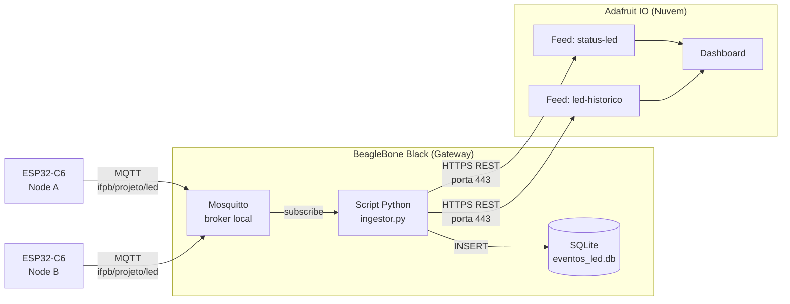
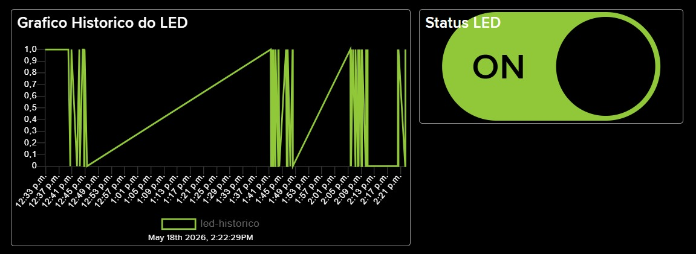

# Controle de Iluminação IoT com Monitoramento em Nuvem e Persistência de Dados

Alberto Viturino  
Ana Beatriz Belo  
Felipe de Freitas  
Irene Isley Silva de Vasconcelos

---

## Sumário

1. [Objetivo](#1-objetivo)
2. [Arquitetura da Solução](#2-arquitetura-da-solução)
3. [Tecnologias e Justificativas](#3-tecnologias-e-justificativas)
4. [Pré-requisitos](#4-pré-requisitos)
5. [Etapa 1 — Configuração da Plataforma de Nuvem (Adafruit IO)](#5-etapa-1--configuração-da-plataforma-de-nuvem-adafruit-io)
6. [Etapa 2 — Persistência Local com SQLite na BeagleBone Black](#6-etapa-2--persistência-local-com-sqlite-na-beaglebone-black)
7. [Etapa 3 — Script Python de Ingestão MQTT → SQLite](#7-etapa-3--script-python-de-ingestão-mqtt--sqlite)
8. [Etapa 4 — Serviço systemd para Execução Automática](#8-etapa-4--serviço-systemd-para-execução-automática)
9. [Etapa 5 — Ponte (Bridge) Mosquitto → Adafruit IO](#9-etapa-5--ponte-bridge-mosquitto--adafruit-io)
10. [Etapa 6 — Alternativa via API REST (Contorno do Bloqueio da Porta 8883)](#10-etapa-6--alternativa-via-api-rest-contorno-do-bloqueio-da-porta-8883)
11. [Etapa 7 — Retain Flag nos Nodes ESP32](#11-etapa-7--retain-flag-nos-nodes-esp32)
12. [Etapa 8 — Dashboard na Adafruit IO](#12-etapa-8--dashboard-na-adafruit-io)
13. [Problemas Encontrados e Soluções](#13-problemas-encontrados-e-soluções)
14. [Comandos Úteis de Referência](#14-comandos-úteis-de-referência)
15. [Boas Práticas de Segurança](#15-boas-práticas-de-segurança)
16. [Conclusão](#16-conclusão)

---

## 1. Objetivo

Integrar o sistema de iluminação IoT desenvolvido no Projeto 1 a uma plataforma de nuvem e a um banco de dados, persistindo o histórico de acionamentos do LED e criando um dashboard para monitoramento remoto. O resultado consolida uma arquitetura IoT ponta a ponta: do atuador embarcado até a visualização em nuvem.

**Requisitos atendidos:**

- Persistência cronológica dos estados do LED com timestamp.
- Replicação dos eventos para uma plataforma em nuvem (Adafruit IO).
- Dashboard remoto com indicador de estado atual e gráfico histórico das últimas 24h.
- Inicialização automática dos serviços no boot do gateway.

---

## 2. Arquitetura da Solução



**Componentes:**

| Componente | Função |
|---|---|
| **ESP32-C6 Nodes** | Publicam o estado do LED no tópico MQTT local. |
| **Mosquitto (BBB)** | Broker MQTT local que recebe mensagens dos nodes. |
| **Script Python (Ingestor)** | Subscreve o tópico, grava no SQLite e publica na Adafruit via REST. |
| **SQLite** | Armazenamento cronológico local (id, estado, timestamp). |
| **Adafruit IO** | Plataforma de nuvem com dashboard. |
| **systemd** | Mantém o serviço de ingestão rodando e o reinicia se cair. |

---

## 3. Tecnologias e Justificativas

### 3.1 Banco de Dados: SQLite (em vez de InfluxDB)

O enunciado oferece **InfluxDB (série temporal)** ou **SQLite/PostgreSQL (relacional)**. A escolha por SQLite foi técnica:

- A **arquitetura da BBB é `armhf` (ARM 32 bits)**, confirmada por `dpkg --print-architecture` e `uname -m` (`armv7l`).
- A **InfluxData não distribui binários oficiais para `armhf`** desde o InfluxDB 2.0. As únicas alternativas seriam Docker (overhead alto) ou InfluxDB 1.x legacy (sem updates).
- A **BBB tem 512 MB de RAM**. O InfluxDB 2.x consome 200–400 MB sozinho, deixando o sistema instável quando somado a Mosquitto, Python e serviços base.
- Para o volume esperado deste projeto (poucos eventos por dia), o SQLite atende ao requisito de "armazenamento cronológico com timestamp" sem overhead.
- O SQLite é **embarcado** (sem daemon, sem porta de rede), o que simplifica a arquitetura e o backup (basta copiar o arquivo `.db`).

> **Defesa técnica:** "InfluxDB 2.x não tem suporte oficial para `armhf` e o consumo de RAM seria proibitivo na BeagleBone Black. Optei por SQLite por adequação à arquitetura do gateway."

### 3.2 Plataforma de Nuvem: Adafruit IO

- Plano gratuito robusto.
- Suporte nativo a MQTT/TLS na porta 8883 **e** API REST HTTPS na porta 443.
- Dashboard simples de configurar (indicador, gráfico histórico, botões).
- Documentação clara.

### 3.3 Ingestão: Python com `paho-mqtt`

- Mais flexível e versionável que Node-RED.
- `paho-mqtt` é a biblioteca de referência (Eclipse Foundation, mantenedora do próprio Mosquitto).
- Fácil de empacotar como serviço systemd.

### 3.4 Replicação para a Nuvem: REST em vez de Bridge MQTT

A solução inicialmente planejada era usar o **bridge nativo do Mosquitto** (MQTT/TLS na porta 8883). Porém, **a rede do laboratório bloqueia a porta 8883**, confirmado por testes:

- DNS resolve normalmente para `io.adafruit.com`.
- Porta 443 (HTTPS) funciona.
- Porta 8883 não estabelece conexão (timeout).
- Porta 443 da Adafruit não aceita MQTT direto (usa MQTT/WebSocket, não suportado pelo bridge Mosquitto).

A solução adotada, com aprovação do professor, foi **publicar via API REST HTTPS da Adafruit IO na porta 443**, mantendo TLS em toda a comunicação externa.

---

## 4. Pré-requisitos

### 4.1 Hardware

- BeagleBone Black com Debian 13 (Trixie), kernel 6.9.x, arquitetura `armhf`.
- ESP32-C6 (Node A e Node B) com firmware do Projeto 1.
- Roteador Wi-Fi com acesso à internet.

### 4.2 Software no PC (Windows)

- Cliente SSH (PowerShell ou cmd já incluem).
- VSCode com extensão ESP-IDF (para flashar os nodes).

### 4.3 Software na BBB

- Mosquitto 2.0.21 já instalado e funcionando (Projeto 1).
- Acesso SSH como usuário `felip`.

### 4.4 Conta Adafruit IO

- Criar conta gratuita em [io.adafruit.com](https://io.adafruit.com).
- Anotar **Username** e **Active Key**.

---

## 5. Etapa 1 — Configuração da Plataforma de Nuvem (Adafruit IO)

### 5.1 Criação dos Feeds

Na Adafruit IO, criar dois feeds:

1. **Feeds → New Feed**.
2. Nome: `status-led` — Descrição: `Estado do LED (ON/OFF)`.
3. Nome: `led-historico` — Descrição: `Histórico de acionamentos (1=ON, 0=OFF)`.

> **Importante:** A Adafruit IO diferencia **Feed Name** (visual) e **Feed Key** (usada pela API). A Key é gerada no momento da criação e **não muda** se você renomear o Feed Name depois. Por isso, ao criar, defina o nome final desejado.

### 5.2 Validação Manual da Conexão

Antes de configurar qualquer integração, valide manualmente que sua rede permite alcançar a Adafruit IO. No PC (Windows, PowerShell):

```powershell
$env:IO_USERNAME = "seu_usuario"
$env:IO_KEY = "sua_chave_aio"

# Publicar mensagem de teste
& "C:\Program Files\mosquitto\mosquitto_pub.exe" -h io.adafruit.com -p 8883 `
  --cafile "$env:USERPROFILE\cacert.pem" `
  -u $env:IO_USERNAME -P $env:IO_KEY `
  -t "$($env:IO_USERNAME)/feeds/status-led" -m "1"
```

Se o comando retornar ao prompt sem erro, a mensagem foi entregue. Confira no feed da Adafruit IO se o valor `1` apareceu no histórico.

### 5.3 Possíveis Problemas

| Erro | Causa | Solução |
|---|---|---|
| `Error: protocol error` | Cliente não consegue fazer handshake TLS | Verificar se `--cafile` aponta para um bundle de CAs válido (`cacert.pem` da curl.se) |
| `Connection Refused: not authorised` | Username ou chave errada | Conferir credenciais; chave AIO tem 32 caracteres começando com `aio_` |
| Comando trava sem resposta | Porta 8883 bloqueada pela rede | Testar com `openssl s_client -connect io.adafruit.com:8883` |

---

## 6. Etapa 2 — Persistência Local com SQLite na BeagleBone Black

### 6.1 Conectar via SSH

```powershell
ssh felip@projeto1.local
```

### 6.2 Instalar o SQLite

```bash
sudo apt update
sudo apt install sqlite3 -y
sqlite3 --version
```

A saída esperada é algo como `3.46.1 2024-08-13 ... (32-bit)`.

> **Por que não precisa "iniciar" o SQLite?** Diferente de InfluxDB ou PostgreSQL, o SQLite **não é um serviço**. Não há daemon, porta ou `systemctl start`. Ele é uma **biblioteca embarcada** que lê e escreve direto em um arquivo `.db`. O "banco" é literalmente o arquivo — pode ser copiado, enviado por e-mail ou backupeado com `cp`.

### 6.3 Criar a Estrutura do Projeto

```bash
mkdir -p ~/projeto-3/data
cd ~/projeto-3
```

### 6.4 Criar o Banco e a Tabela

```bash
sqlite3 eventos_led.db <<'EOF'
CREATE TABLE IF NOT EXISTS eventos (
    id INTEGER PRIMARY KEY AUTOINCREMENT,
    estado TEXT NOT NULL,
    data_hora TEXT NOT NULL
);

CREATE INDEX IF NOT EXISTS idx_eventos_data_hora ON eventos(data_hora);

.tables
.schema eventos
EOF
```

**O que cada campo faz:**

- `id`: chave primária auto-incrementada (identidade única do evento).
- `estado`: estado do LED como texto (`"ON"` ou `"OFF"`).
- `data_hora`: timestamp em formato `YYYY-MM-DD HH:MM:SS`.
- **Índice em `data_hora`**: acelera consultas por intervalo (ex: últimas 24h).

### 6.5 Teste de Inserção

```bash
sqlite3 eventos_led.db "INSERT INTO eventos (estado, data_hora) VALUES ('ON', '2026-05-18 15:00:00');"
sqlite3 eventos_led.db "SELECT * FROM eventos;"
```

Saída esperada: `1|ON|2026-05-18 15:00:00`.

---

## 7. Etapa 3 — Script Python de Ingestão MQTT → SQLite

### 7.1 Instalação das Dependências

```bash
sudo apt install python3-paho-mqtt python3-requests -y
```

Verificar:

```bash
python3 -c "import paho.mqtt.client; import requests; print('OK')"
```

> **Por que `python3-paho-mqtt` via `apt` e não `pip install`?** No Debian moderno, usar `apt` integra o pacote ao gerenciamento do sistema. Evita conflitos com o Python do sistema e dispensa ambiente virtual para projetos simples como este.

### 7.2 Script `ingestor.py`

Criar o arquivo:

```bash
nano ~/projeto-3/ingestor.py
```

Conteúdo:

```python
#!/usr/bin/env python3
"""
Ingestor MQTT -> SQLite + Adafruit IO (REST)
Subscreve no broker local, grava cada evento no SQLite
e publica na Adafruit IO via API REST.
"""

import sqlite3
from datetime import datetime
import paho.mqtt.client as mqtt
import requests

# ----- Configuração -----
LOCAL_BROKER = "localhost"
LOCAL_TOPIC = "ifpb/projeto/led"

ADAFRUIT_USER = "seu_usuario"
ADAFRUIT_KEY = "sua_chave_aqui"

ADAFRUIT_TOPIC_STATUS = f"{ADAFRUIT_USER}/feeds/status-led"
ADAFRUIT_TOPIC_HISTORICO = f"{ADAFRUIT_USER}/feeds/led-historico"

DB_NAME = "eventos_led.db"

# ----- Banco de dados -----
def salvar_no_banco(estado):
    data_hora = datetime.now().strftime("%Y-%m-%d %H:%M:%S")
    conexao = sqlite3.connect(DB_NAME)
    cursor = conexao.cursor()
    cursor.execute(
        "INSERT INTO eventos (estado, data_hora) VALUES (?, ?)",
        (estado, data_hora)
    )
    conexao.commit()
    conexao.close()
    print(f"Salvo no banco: {estado} em {data_hora}")

# ----- Publicação na nuvem (REST) -----
def publicar_na_nuvem(estado):
    valor_historico = "1" if estado == "ON" else "0"
    url_status = f"https://io.adafruit.com/api/v2/{ADAFRUIT_USER}/feeds/status-led/data"
    url_historico = f"https://io.adafruit.com/api/v2/{ADAFRUIT_USER}/feeds/led-historico/data"
    headers = {
        "X-AIO-Key": ADAFRUIT_KEY,
        "Content-Type": "application/json"
    }
    try:
        r1 = requests.post(url_status, headers=headers, json={"value": estado}, timeout=10)
        r2 = requests.post(url_historico, headers=headers, json={"value": valor_historico}, timeout=10)
        if r1.status_code in (200, 201) and r2.status_code in (200, 201):
            print(f"Publicado na nuvem: {estado} / {valor_historico}")
        else:
            print("Erro ao publicar na nuvem")
            print(r1.status_code, r1.text)
            print(r2.status_code, r2.text)
    except requests.RequestException as e:
        print(f"Falha de rede ao publicar: {e}")

# ----- Callbacks MQTT -----
def on_connect(client, userdata, flags, rc):
    print("Conectado ao broker local")
    client.subscribe(LOCAL_TOPIC)

def on_message(client, userdata, msg):
    estado = msg.payload.decode().strip()
    print(f"Mensagem recebida: {estado}")
    if estado in ["ON", "OFF"]:
        salvar_no_banco(estado)
        publicar_na_nuvem(estado)
    else:
        print("Mensagem ignorada")

# ----- Main -----
client = mqtt.Client()
client.on_connect = on_connect
client.on_message = on_message
client.connect(LOCAL_BROKER, 1883, 60)
client.loop_forever()
```

Salvar com **Ctrl+O**, **Enter**, **Ctrl+X**.

### 7.3 Verificação de Sintaxe

```bash
python3 -m py_compile ingestor.py
```

Sem saída = sintaxe ok. Se houver erro, a linha problemática é apontada.

### 7.4 Teste Manual

**Janela 1** (rodar o script):

```bash
cd ~/projeto-3
python3 ingestor.py
```

Saída esperada:
```
Conectado ao broker local
```

**Janela 2** (publicar mensagem):

```bash
ssh felip@projeto1.local
mosquitto_pub -h localhost -t ifpb/projeto/led -m "ON"
```

**Janela 1** deve mostrar:
```
Mensagem recebida: ON
Salvo no banco: ON em 2026-05-18 15:39:50
Publicado na nuvem: ON / 1
```

E os feeds `status-led` e `led-historico` na Adafruit IO devem receber os valores em tempo real.

---

## 8. Etapa 4 — Serviço systemd para Execução Automática

O script precisa rodar **continuamente** e **iniciar sozinho no boot**. O systemd resolve isso.

### 8.1 Criar o Arquivo de Serviço

```bash
sudo nano /etc/systemd/system/ingestor.service
```

Conteúdo:

```ini
[Unit]
Description=Ingestor MQTT -> SQLite + Adafruit (Projeto IoT IFPB)
After=network-online.target mosquitto.service
Wants=network-online.target
Requires=mosquitto.service

[Service]
Type=simple
User=felip
Group=felip
WorkingDirectory=/home/felip/projeto-3
ExecStart=/usr/bin/python3 /home/felip/projeto-3/ingestor.py
Restart=on-failure
RestartSec=5s

StandardOutput=journal
StandardError=journal
SyslogIdentifier=ingestor

[Install]
WantedBy=multi-user.target
```

**Explicação dos campos críticos:**

| Campo | Função |
|---|---|
| `After` / `Requires=mosquitto.service` | Garante que o Mosquitto esteja rodando antes do ingestor iniciar |
| `User=felip` | Roda como usuário comum |
| `WorkingDirectory` | Permite o script encontrar o banco via path relativo |
| `Restart=on-failure` | Se o script crashar, o systemd reinicia automaticamente após 5s |
| `WantedBy=multi-user.target` | Inicia automaticamente no boot |

### 8.2 Habilitar e Iniciar

```bash
sudo systemctl daemon-reload
sudo systemctl enable ingestor.service
sudo systemctl start ingestor.service
sudo systemctl status ingestor.service --no-pager
```

Saída esperada: `Active: active (running)`.

### 8.3 Acompanhar Logs

```bash
sudo journalctl -u ingestor.service -f
```

Sair com **Ctrl+C** (não para o serviço, só fecha a visualização).

### 8.4 Comandos Úteis

| Ação | Comando |
|---|---|
| Status | `sudo systemctl status ingestor` |
| Parar | `sudo systemctl stop ingestor` |
| Iniciar | `sudo systemctl start ingestor` |
| Reiniciar (após editar o `.py`) | `sudo systemctl restart ingestor` |
| Logs em tempo real | `sudo journalctl -u ingestor -f` |
| Últimas 50 linhas | `sudo journalctl -u ingestor -n 50` |
| Logs de hoje | `sudo journalctl -u ingestor --since today` |

---

## 9. Etapa 5 — Ponte (Bridge) Mosquitto → Adafruit IO

> **Atenção:** Esta etapa foi tentada inicialmente mas **não funcionou no ambiente do laboratório** devido ao bloqueio da porta 8883. A solução final foi via API REST (Etapa 6). A configuração da bridge é documentada aqui por completude, pois funciona em redes sem o bloqueio.

### 9.1 Verificar a Estrutura do Mosquitto

```bash
sudo systemctl status mosquitto --no-pager
ls -la /etc/mosquitto/
cat /etc/mosquitto/mosquitto.conf
```

O `mosquitto.conf` deve ter `include_dir /etc/mosquitto/conf.d` no final — isso permite adicionar configurações isoladas.

### 9.2 Copiar Bundle de Certificados Raiz

```bash
sudo cp /etc/ssl/certs/ca-certificates.crt /etc/mosquitto/ca_certificates/ca-bundle.crt
ls -la /etc/mosquitto/ca_certificates/
```

### 9.3 Criar o Arquivo da Bridge

```bash
sudo nano /etc/mosquitto/conf.d/bridge-adafruit.conf
```

Conteúdo:

```conf
# Bridge MQTT: Mosquitto local (BBB) -> Adafruit IO (nuvem)

connection bridge-adafruit
address io.adafruit.com:8883

remote_username SEU_USUARIO
remote_password SUA_AIO_KEY
remote_clientid bbb-projeto3-bridge

bridge_cafile /etc/mosquitto/ca_certificates/ca-bundle.crt
bridge_insecure false

# Mapeamento: local "ifpb/projeto/led" -> remoto "USUARIO/feeds/status-led"
topic ifpb/projeto/led out 1 "" SEU_USUARIO/feeds/status-led

try_private false
cleansession true
notifications false
start_type automatic
restart_timeout 10
```

### 9.4 Proteger o Arquivo (contém credencial)

```bash
sudo chmod 600 /etc/mosquitto/conf.d/bridge-adafruit.conf
sudo chown root:root /etc/mosquitto/conf.d/bridge-adafruit.conf
```

### 9.5 Reiniciar e Verificar Logs

```bash
sudo systemctl restart mosquitto
sudo tail -n 30 /var/log/mosquitto/mosquitto.log
```

Esperado: linhas com `Connecting bridge ... (io.adafruit.com:8883)` seguidas de `received CONNACK (0)` (sucesso) ou erro específico.

### 9.6 Diagnóstico de Falha da Bridge

Se a bridge ficar em loop `Connecting (step 1)` / `(step 2)` sem chegar a CONNACK, testar conectividade na BBB:

```bash
# 1. DNS resolve?
getent hosts io.adafruit.com

# 2. Porta 8883 está aberta?
echo "" | timeout 15 openssl s_client -connect io.adafruit.com:8883 -servername io.adafruit.com 2>&1 | head -10

# 3. Internet geral funciona?
ping -c 3 8.8.8.8

# 4. HTTPS na 443 funciona?
curl -v -m 10 https://io.adafruit.com 2>&1 | head -20
```

Se 8883 não responde mas 443 funciona, a rede bloqueia portas não-padrão.

---

## 10. Etapa 6 — Alternativa via API REST (Contorno do Bloqueio da Porta 8883)

### 10.1 Diagnóstico do Problema

A rede do laboratório apresentou o seguinte comportamento, confirmado por múltiplos testes:

| Teste | Resultado |
|---|---|
| `ping 8.8.8.8` | ✅ Funciona |
| DNS resolve `io.adafruit.com` | ✅ Funciona |
| `curl https://io.adafruit.com` (porta 443) | ✅ Funciona (TLS 1.3 completo) |
| `openssl s_client -connect io.adafruit.com:8883` | ❌ Travamento sem CONNACK |
| `mosquitto_pub -h io.adafruit.com -p 8883` | ❌ Trava indefinidamente |

A causa foi identificada como **firewall corporativo do laboratório** (cabeçalho HTTP retornou `X-Cache: MISS from arianosuassuna`, indicando proxy intermediário). A porta 443 estava liberada, mas 8883 não.

### 10.2 Solução Adotada

Em vez do bridge MQTT/TLS na 8883, o script Python **publica diretamente na API REST da Adafruit IO via HTTPS (porta 443)**:

- Mantém TLS em toda comunicação externa.
- Usa a mesma porta que a rede do laboratório libera (443).
- A lógica de publicação fica no próprio script de ingestão, sem necessidade de bridge.

A implementação está no `ingestor.py` (Etapa 3), na função `publicar_na_nuvem()`.

> **Defesa técnica:** "Como a porta 8883 (MQTT/TLS padrão) está bloqueada pela rede do laboratório, optei por replicar via API REST HTTPS na porta 443, suportada oficialmente pela Adafruit IO. O TLS é mantido em toda comunicação externa, e o MQTT continua sendo usado localmente entre nodes e gateway."

---

## 11. Etapa 7 — Retain Flag nos Nodes ESP32

### 11.1 O que é Retain Flag

Quando um cliente MQTT publica com `retain=true`, o broker **guarda a última mensagem** desse tópico. Qualquer cliente que se conectar depois e subscrever no tópico recebe imediatamente essa última mensagem retida.

**Caso de uso:** se o dashboard da nuvem for aberto após o evento, ele precisa saber o último estado do LED. Sem retain, fica em branco até a próxima publicação.

### 11.2 Modificação no Código ESP-IDF

No firmware do node (geralmente em `nodeB/main/main.c` ou similar), localizar a chamada de publicação:

```c
// Antes (sem retain)
esp_mqtt_client_publish(client, "ifpb/projeto/led", "ON", 0, 1, 0);
//                                                              ^
//                                                       último arg = retain (0 = não)

// Depois (com retain)
esp_mqtt_client_publish(client, "ifpb/projeto/led", "ON", 0, 1, 1);
//                                                              ^
//                                                       último arg = retain (1 = sim)
```

**Assinatura da função:**

```c
int esp_mqtt_client_publish(
    esp_mqtt_client_handle_t client,
    const char *topic,
    const char *data,
    int len,        // 0 = calcula com strlen automaticamente
    int qos,        // nível de qualidade (0, 1 ou 2)
    int retain      // 0 ou 1
);
```

### 11.3 Compilar e Flashar

No VSCode com a extensão ESP-IDF, abrir **a pasta do projeto** (não a pasta pai). Estrutura esperada:

```
projeto-X/
├── CMakeLists.txt        ← deve existir na raiz
├── sdkconfig
└── main/
    ├── CMakeLists.txt
    └── main.c
```

Comandos no **ESP-IDF Terminal** (não no PowerShell comum):

```bash
idf.py build
idf.py -p COM3 flash monitor    # substituir COM3 pela porta correta
```

A porta COM pode ser encontrada no **Gerenciador de Dispositivos do Windows → Portas (COM e LPT)**.

### 11.4 Validação

Após publicar com retain ativo, ao reiniciar o broker (ou simular novo cliente):

```bash
mosquitto_sub -h localhost -t ifpb/projeto/led -C 1
```

A flag `-C 1` faz desconectar após receber 1 mensagem. Se aparecer imediatamente o último valor publicado, retain está funcionando.

---

## 12. Etapa 8 — Dashboard na Adafruit IO

### 12.1 Criar o Dashboard

1. Adafruit IO → **Dashboards** → **New Dashboard**.
2. Nome: `Controle de Iluminação IoT`.

### 12.2 Adicionar Blocos

Clicar no botão **+** dentro do dashboard:

**Bloco 1 — Indicador de Estado Atual (Toggle ou Indicator):**
- Tipo: **Indicator Block**.
- Feed: `status-led`.
- Conditions: `"ON"` → verde / `"OFF"` → vermelho (ou cores à escolha).
- Título: `Status LED`.

**Bloco 2 — Gráfico de Histórico (Line Chart):**
- Tipo: **Line Chart Block**.
- Feed: `led-historico`.
- Período: **Show history**: `24 hours`.
- Título: `Grafico Historico do LED`.

**Bloco 3 (Opcional) — Botão de Comando Reverso:**
- Tipo: **Toggle Block**.
- Feed: feed novo `comando-led` (criar antes).
- Estados: `ON` / `OFF`.
- Para o comando funcionar, o ingestor precisa **também subscrever** nesse feed (via bridge inverso ou via MQTT/WebSocket com biblioteca cliente).

### 12.3 Resultado Final

O dashboard fica acessível pela URL pública (se você marcar como público) ou apenas com login. Atualiza em tempo real conforme os nodes publicam.



A imagem acima mostra o dashboard funcionando após várias publicações de teste: o **bloco "Status LED"** à direita reflete o último estado recebido (`ON`), e o **gráfico histórico** à esquerda mostra a sequência de acionamentos ao longo do tempo, com valores `1` (ligado) e `0` (desligado) marcados em cada timestamp.

---

## 13. Problemas Encontrados e Soluções

### 13.1 Problema: `command not found: mosquitto_pub` no Windows

**Causa:** Mosquitto instalado mas não está no PATH.

**Solução:**
- Verificar instalação: `Test-Path "C:\Program Files\mosquitto"`.
- Adicionar `C:\Program Files\mosquitto` ao PATH do sistema (Variáveis de Ambiente).
- Ou usar caminho completo: `& "C:\Program Files\mosquitto\mosquitto_pub.exe" ...`.

### 13.2 Problema: `Error: protocol error` ao testar MQTT/TLS

**Causa:** Cliente Mosquitto no Windows não acha certificados raiz por padrão.

**Solução:** Baixar bundle de CAs:

```powershell
Invoke-WebRequest -Uri "https://curl.se/ca/cacert.pem" -OutFile "$env:USERPROFILE\cacert.pem"
```

E usar `--cafile "$env:USERPROFILE\cacert.pem"` no comando.

### 13.3 Problema: InfluxDB não instala via apt

**Causa:** O pacote `influxdb` (servidor) **foi removido do Debian Trixie**. Apenas `influxdb-client` está disponível, e ele é só o cliente, não o servidor.

**Solução:** Adoção do SQLite (Seção 3.1).

### 13.4 Problema: Bridge Mosquitto fica em loop `Connecting`

**Causa:** Porta 8883 bloqueada pela rede do laboratório.

**Solução:** Mudança para API REST via HTTPS/443 (Etapa 6).

### 13.5 Problema: Adafruit IO retorna 404 ao publicar

**Causa:** A **Feed Key** (usada na URL da API) não muda quando você renomeia o Feed Name visualmente.

**Solução:**
- Conferir a Key real em Feeds → clicar no feed → ver "Feed Info → Key".
- Usar o nome da Key no script, não o Feed Name visual.

### 13.6 Problema: Script Python interpretado como comandos bash

**Causa:** Colar código Python direto no terminal (fora do nano).

**Solução:** Sempre abrir o nano **primeiro** (`nano arquivo.py`), depois colar.

### 13.7 Problema: VSCode com ESP-IDF retorna `CMakeLists.txt does not exist`

**Causa:** Pasta aberta no VSCode é a pasta **pai** dos projetos, não a pasta do projeto específico.

**Solução:** **File → Close Folder**, depois **File → Open Folder** apontando para a pasta exata do projeto (que contém `CMakeLists.txt` na raiz).

### 13.8 Problema: `idf.py: command not found`

**Causa:** Comando rodado no PowerShell comum, não no **ESP-IDF Terminal**.

**Solução:** Abrir o terminal específico do ESP-IDF (no VSCode, opção no menu de terminais).

### 13.9 Problema: BBB perde conexão de rede

**Causa:** Cabo Ethernet com mau contato, ou interface `eth0` travada.

**Diagnóstico:**
- LEDs da BBB ainda piscando? → travamento de software, fazer reset físico.
- LED da porta Ethernet apagado? → cabo ou roteador.

**Solução:** Reset físico (botão preto perto do micro-USB), aguardar 1 min para boot.

---

## 14. Comandos Úteis de Referência

### 14.1 Na BBB

```bash
# Status dos serviços
sudo systemctl status mosquitto
sudo systemctl status ingestor

# Logs do ingestor em tempo real
sudo journalctl -u ingestor.service -f

# Reiniciar o ingestor após editar o script
sudo systemctl restart ingestor.service

# Consultar o banco
sqlite3 ~/projeto-3/eventos_led.db "SELECT * FROM eventos ORDER BY id DESC LIMIT 10;"

# Contar eventos por estado
sqlite3 ~/projeto-3/eventos_led.db "SELECT estado, COUNT(*) FROM eventos GROUP BY estado;"

# Eventos das últimas 24h
sqlite3 ~/projeto-3/eventos_led.db \
  "SELECT * FROM eventos WHERE data_hora > datetime('now', '-1 day');"

# Backup do banco
cp ~/projeto-3/eventos_led.db ~/projeto-3/eventos_led.db.bak

# Publicar mensagem de teste
mosquitto_pub -h localhost -t ifpb/projeto/led -m "ON"
mosquitto_pub -h localhost -t ifpb/projeto/led -m "OFF"

# Subscrever no tópico (para debug)
mosquitto_sub -h localhost -t ifpb/projeto/led -v

# Ver configuração do Mosquitto
cat /etc/mosquitto/mosquitto.conf
ls /etc/mosquitto/conf.d/
```

### 14.2 Testes de Conectividade

```bash
# DNS funciona?
getent hosts io.adafruit.com

# Porta 443 (HTTPS)
curl -v -m 10 https://io.adafruit.com | head

# Porta 8883 (MQTT/TLS)
echo "" | timeout 15 openssl s_client -connect io.adafruit.com:8883 -servername io.adafruit.com | head

# Teste REST API direto
curl -X POST https://io.adafruit.com/api/v2/SEU_USUARIO/feeds/status-led/data \
  -H "X-AIO-Key: SUA_CHAVE" \
  -H "Content-Type: application/json" \
  -d '{"value": "ON"}'
```

### 14.3 No PC (Windows)

```powershell
# Conectar à BBB
ssh felip@projeto1.local

# Testar MQTT na Adafruit (após instalar mosquitto-clients)
& "C:\Program Files\mosquitto\mosquitto_pub.exe" -h io.adafruit.com -p 8883 `
  --cafile "$env:USERPROFILE\cacert.pem" `
  -u $env:IO_USERNAME -P $env:IO_KEY `
  -t "$($env:IO_USERNAME)/feeds/status-led" -m "ON"
```

---

## 15. Boas Práticas de Segurança

### 15.1 Credenciais

Variável de ambiente, lida no script:

```python
import os
ADAFRUIT_KEY = os.environ.get("ADAFRUIT_KEY")
if not ADAFRUIT_KEY:
    raise RuntimeError("Variável ADAFRUIT_KEY não definida")
```

E no arquivo systemd:

```ini
[Service]
Environment="ADAFRUIT_KEY=aio_xxxxxxxxxxxxxxxx"
```

Restringir permissões: `sudo chmod 600 /etc/systemd/system/ingestor.service`.

### 15.2 Repositório Git

Antes do primeiro commit, criar `.gitignore`:

```
*.db
*.db.bak
__pycache__/
*.pyc
.env
secrets.conf
```

Se a chave foi exposta em algum momento, **regenerar imediatamente** na Adafruit IO (My Key → REGENERATE KEY).

### 15.3 Arquivos de Configuração com Senha

```bash
# Restringir leitura para root apenas
sudo chmod 600 /etc/mosquitto/conf.d/bridge-adafruit.conf
sudo chown root:root /etc/mosquitto/conf.d/bridge-adafruit.conf
```

---

## 16. Conclusão

### 16.1 Resultados Alcançados

| Requisito do Projeto | Status |
|---|---|
| Persistência de eventos no banco | ✅ SQLite com índice em timestamp |
| Replicação para a nuvem | ✅ Via REST/HTTPS (alternativa ao bridge MQTT) |
| Dashboard de monitoramento | ✅ Adafruit IO com indicador e histórico |
| TLS na comunicação externa | ✅ Via HTTPS na porta 443 |
| Retain flag nos nodes | ✅ Implementado no firmware ESP-IDF |
| Inicialização automática | ✅ Via serviço systemd |

### 16.2 Aprendizados

- **Restrições de rede são reais.** Soluções "ideais" da literatura nem sempre rodam em redes corporativas; saber diagnosticar e adaptar é parte do trabalho de engenharia.
- **A escolha de tecnologia precisa considerar o hardware.** InfluxDB 2.x seria a escolha "moderna", mas inviável em `armhf` com 512 MB de RAM.
- **systemd transforma scripts em serviços robustos.** Restart automático, logs centralizados via `journalctl`, e inicialização no boot foram conquistas importantes do projeto.
- **Diagnóstico estruturado economiza horas.** Testar componentes isoladamente (DNS, porta, TLS, credencial) antes de configurar a integração final ajudou a identificar rapidamente o bloqueio da porta 8883.

### 16.3 Possíveis Melhorias Futuras

- **Comando reverso completo** (Adafruit → BBB → Node): implementar subscrição da Adafruit no script de ingestão, e publicar no broker local quando comandos chegarem.
- **Grafana local** para dashboard offline com dados do SQLite.
- **Métricas operacionais**: tempo médio entre eventos, número de acionamentos por hora, etc.
- **Notificações** (Telegram, email) para eventos específicos.
- **Migração de credenciais** para variáveis de ambiente ou serviços de secret management.

---

## Apêndice A — Estrutura Final de Arquivos

### Na BBB

```
/home/felip/projeto-3/
├── ingestor.py              # Script principal
├── ingestor.py.bak          # Backup (recomendado)
├── eventos_led.db           # Banco SQLite com histórico
└── data/
    └── iluminacao.db        # Banco antigo (versão inicial)

/etc/systemd/system/
└── ingestor.service         # Definição do serviço systemd

/etc/mosquitto/conf.d/
├── external.conf            # Listener em todas as interfaces (Projeto 1)
└── bridge-adafruit.conf     # Configuração da bridge (não utilizado, mas documentado)

/etc/mosquitto/ca_certificates/
└── ca-bundle.crt            # Bundle de CAs para TLS
```

### No PC (Windows)

```
C:\Users\<user>\iot2026_1\
├── projeto-1\
│   ├── nodeA\               # Firmware do Node A
│   └── nodeB\               # Firmware do Node B
├── projeto-2\               # Firmware atualizado
├── projeto-3\               # Documentação e scripts
└── RELATORIO_PROJETO_3.md   # Este arquivo
```

---

## Apêndice B — Referências

- **Documentação oficial Mosquitto:** https://mosquitto.org/documentation/
- **Eclipse Paho MQTT Python:** https://github.com/eclipse/paho.mqtt.python
- **Adafruit IO API:** https://io.adafruit.com/api/docs/
- **ESP-IDF Programming Guide:** https://docs.espressif.com/projects/esp-idf/
- **SQLite Documentation:** https://www.sqlite.org/docs.html
- **systemd unit files:** `man systemd.service`

---