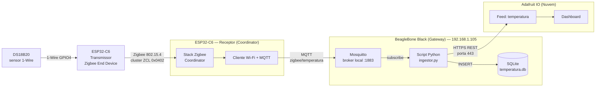

# Relatório Acadêmico — Monitoramento de Temperatura via Zigbee

**Instituição:** Instituto Federal da Paraíba — Campus Campina Grande  
**Disciplina:** Internet das Coisas  
**Data:** 26 de Junho de 2026  

**Grupo:**
- Alberto Viturino Mamede
- Ana Beatriz Belo de Assis Menezes
- Felipe de Freitas Sales dos Santos
- Irene Isley Silva de Vasconcelos

---

## Sumário

1. [Objetivo](#1-objetivo)
2. [Arquitetura da Solução](#2-arquitetura-da-solução)
3. [Tecnologias e Justificativas](#3-tecnologias-e-justificativas)
4. [Pré-requisitos](#4-pré-requisitos)
5. [Etapa 1 — Preparação do Ambiente ESP-IDF (PC)](#5-etapa-1--preparação-do-ambiente-esp-idf-pc)
6. [Etapa 2 — Firmware do Transmissor (Zigbee End Device)](#6-etapa-2--firmware-do-transmissor-zigbee-end-device)
7. [Etapa 3 — Firmware do Receptor (Zigbee Coordinator)](#7-etapa-3--firmware-do-receptor-zigbee-coordinator)
8. [Etapa 4 — Compilação, Gravação e Pareamento](#8-etapa-4--compilação-gravação-e-pareamento)
9. [Etapa 5 — Configuração do Broker MQTT (BeagleBone Black)](#9-etapa-5--configuração-do-broker-mqtt-beaglebone-black)
10. [Etapa 6 — Persistência Local com SQLite](#10-etapa-6--persistência-local-com-sqlite)
11. [Etapa 7 — Script Python de Ingestão (MQTT → SQLite → Nuvem)](#11-etapa-7--script-python-de-ingestão-mqtt--sqlite--nuvem)
12. [Etapa 8 — Dashboard na Adafruit IO](#12-etapa-8--dashboard-na-adafruit-io)
13. [Problemas Encontrados e Soluções](#13-problemas-encontrados-e-soluções)
14. [Comandos Úteis de Referência](#14-comandos-úteis-de-referência)
15. [Boas Práticas de Segurança](#15-boas-práticas-de-segurança)
16. [Conclusão](#16-conclusão)

---

## 1. Objetivo

Desenvolver um sistema IoT funcional de monitoramento ambiental ponta a ponta, medindo **temperatura** com um sensor DS18B20 e transmitindo a leitura por uma rede sem fio **Zigbee** (IEEE 802.15.4) até um gateway, que persiste os dados localmente e os encaminha para uma plataforma de nuvem com dashboard.

O escopo do Grupo 2 (Monitoramento Ambiental) previa temperatura e umidade, ponto de orvalho e alarmes de alta/baixa para ambas as grandezas. Por decisão de escopo acordada no início do projeto, **a umidade e o ponto de orvalho foram removidos**, concentrando o esforço na cadeia ponta a ponta de temperatura.

**Requisitos atendidos:**

- Medição de temperatura com sensor dedicado (DS18B20, 1-Wire).
- Transmissão sem fio via Zigbee entre nó sensor (End Device) e gateway (Coordinator).
- Gateway com broker MQTT, banco de dados local e ponte para a nuvem.
- Dashboard remoto com histórico de temperatura e indicador de status (alarme).

---

## 2. Arquitetura da Solução

O sistema segue o modelo clássico de três camadas de IoT: **End Device → Gateway → Nuvem**.



**Componentes:**

| Componente | Função |
|---|---|
| **DS18B20** | Sensor digital de temperatura no barramento 1-Wire (GPIO 4 do transmissor). |
| **ESP32-C6 Transmissor** | Zigbee End Device; lê o sensor e expõe a temperatura no cluster ZCL 0x0402. |
| **ESP32-C6 Receptor** | Zigbee Coordinator; recebe a temperatura e publica via MQTT pela Wi-Fi. |
| **Mosquitto (BBB)** | Broker MQTT local que recebe a temperatura do receptor. |
| **Script Python (Ingestor)** | Subscreve o tópico, grava no SQLite e publica na Adafruit via REST. |
| **SQLite** | Armazenamento cronológico local (id, valor, timestamp). |
| **Adafruit IO** | Plataforma de nuvem com dashboard (histórico + LED de status). |

---

## 3. Tecnologias e Justificativas

### 3.1 Rede sem fio: Zigbee com ESP32-C6 (em vez de Wi-Fi com ESP32-S3)

O enunciado citava "ESP32-C6 (WiFi/BLE/Zigbee) ou ESP32-S3 (WiFi/BLE)". A escolha foi técnica:

- O objetivo do Grupo 2 era usar **Zigbee** (IEEE 802.15.4) entre nó e gateway.
- O **ESP32-S3 não possui rádio 802.15.4** — só tem Wi-Fi e Bluetooth LE. Portanto não faz Zigbee.
- O **ESP32-C6** é o membro da família que integra o rádio 802.15.4, sendo o único viável para Zigbee.
- Zigbee exige **dois papéis distintos**: um **End Device** (o nó sensor) e um **Coordinator** (que forma a rede). Por isso o projeto usa **dois ESP32-C6**.

> **Defesa técnica:** "O ESP32-S3 não tem rádio IEEE 802.15.4, logo não suporta Zigbee. Para atender o requisito de rede Zigbee do Grupo 2, foram usados dois ESP32-C6, um como End Device e outro como Coordinator."

### 3.2 Sensor: DS18B20 (1-Wire)

- Sensor **dedicado a temperatura**, robusto e digital.
- Usa o protocolo **1-Wire**, ocupando um único GPIO (mais o pull-up).
- Como o escopo é só temperatura, é a opção mais "limpa" conceitualmente (sem umidade a descartar).
- Há **componentes oficiais** do ESP-IDF (`onewire_bus` e `ds18b20`) que abstraem a temporização do protocolo.

### 3.3 Banco de Dados: SQLite

- O SQLite é **embarcado** (sem daemon, sem porta de rede), simplificando a arquitetura e o backup (basta copiar o arquivo `.db`).
- Atende ao requisito de "armazenamento cronológico com timestamp" sem overhead, adequado ao hardware da BeagleBone Black.

### 3.4 Plataforma de Nuvem: Adafruit IO

- Plano gratuito robusto.
- Suporte a API REST HTTPS na porta 443 (porta normalmente liberada nas redes).
- Dashboard simples de configurar (gráfico de linha, indicador/LED de status).

### 3.5 Ingestão: Python com `paho-mqtt`

- `paho-mqtt` é a biblioteca de referência (Eclipse Foundation).
- Permite, no mesmo script, subscrever o MQTT local, gravar no SQLite e publicar na nuvem via REST.

---

## 4. Pré-requisitos

### 4.1 Hardware

- 2× ESP32-C6 (um Transmissor/End Device, um Receptor/Coordinator).
- Sensor DS18B20 + resistor de pull-up de 4,7 kΩ.
- BeagleBone Black (Debian) como gateway, na mesma rede Wi-Fi dos ESP.
- Cabos USB **de dados** (não apenas de carga) para gravar os ESP32.

**Ligação do DS18B20 (no transmissor):**

- **VDD** → 3,3 V
- **GND** → GND
- **DQ (dados)** → GPIO 4
- **Pull-up de 4,7 kΩ** entre DQ e 3,3 V (obrigatório para o 1-Wire)

### 4.2 Software no PC (Windows)

- ESP-IDF v5.5.3 em `C:\esp\v5.5.3\esp-idf\`.
- VS Code com extensão ESP-IDF.
- PowerShell (a ativação do ESP-IDF usa sintaxe ponto-espaço, que não funciona no CMD).

### 4.3 Software na BBB

- Mosquitto (broker MQTT).
- Python 3 com `paho-mqtt` e `requests`.
- SQLite 3.
- Acesso SSH (usuário `irene`).

### 4.4 Conta Adafruit IO

- Conta gratuita em [io.adafruit.com](https://io.adafruit.com).
- Anotar **Username** e **AIO Key**, e criar um feed `temperatura`.

---

## 5. Etapa 1 — Preparação do Ambiente ESP-IDF (PC)

### 5.1 Ativação do ambiente

Em **toda nova sessão** do PowerShell, antes de qualquer comando `idf.py`:

```powershell
. C:\esp\v5.5.3\esp-idf\export.ps1
```

> **Importante:** essa sintaxe (`.` seguido de espaço, "dot-sourcing") funciona apenas no PowerShell, não no CMD. Ao usar o "ESP-IDF Terminal" da extensão do VS Code, o ambiente já vem ativado automaticamente.

### 5.2 Estrutura de pastas dos projetos

A raiz de um projeto ESP-IDF é a pasta que contém **diretamente** o `CMakeLists.txt` de topo e a pasta `main/`. Essa raiz frequentemente está aninhada mais fundo que a pasta descompactada — abrir o nível errado causa erro de CMake (ver Seção 13.1).

Estrutura do **transmissor**:

```
Iot_Zigbee/                 <- RAIZ DO PROJETO (transmissor)
├── CMakeLists.txt
├── partitions.csv
├── sdkconfig.defaults
└── main/
    ├── CMakeLists.txt
    ├── main.c
    ├── transmissor.c / transmissor.h
    ├── ds18b20_sensor.c / ds18b20_sensor.h
    └── idf_component.yml
```

Estrutura do **receptor**:

```
Iot_Zigbee/receptor/        <- RAIZ DO PROJETO (receptor)
├── CMakeLists.txt
├── partitions.csv
├── sdkconfig.defaults
└── main/
    ├── CMakeLists.txt
    ├── main.c
    ├── receptor.c / receptor.h
    ├── rede.c / rede.h
    └── idf_component.yml
```

### 5.3 Definição do alvo (target)

O ESP32-C6 precisa ser definido explicitamente como alvo (o padrão do ESP-IDF é o ESP32 comum, sem rádio Zigbee):

```powershell
idf.py set-target esp32c6
```

> **Atenção:** `set-target` **reseta o `sdkconfig`**. Se o projeto já vem com `sdkconfig.defaults` configurado, normalmente não é preciso rodá-lo de novo — basta `idf.py build`. Use `idf.py reconfigure` para verificar sem apagar configurações.

### 5.4 Dependências dos componentes

O `idf_component.yml` declara as dependências, baixadas automaticamente na primeira compilação:

```yaml
dependencies:
  idf: ">=5.1"
  espressif/esp-zboss-lib: "~1.6.4"
  espressif/esp-zigbee-lib: "~1.6.4"
  espressif/onewire_bus: "*"
  espressif/ds18b20: "*"
```

---

## 6. Etapa 2 — Firmware do Transmissor (Zigbee End Device)

O transmissor lê o DS18B20 e expõe a temperatura no cluster ZCL de Temperatura (0x0402), no endpoint 10.

### 6.1 Configuração do End Device (`transmissor.h`)

```c
#define HA_ESP_SENSOR_ENDPOINT      10
#define ESP_ZB_PRIMARY_CHANNEL_MASK ESP_ZB_TRANSCEIVER_ALL_CHANNELS_MASK
#define DS18B20_GPIO_NUM              (4)
#define TEMP_SENSOR_UPDATE_INTERVAL_S (1)

#define ESP_ZB_ZED_CONFIG()                                \
    {                                                       \
        .esp_zb_role = ESP_ZB_DEVICE_TYPE_ED,                \
        .install_code_policy = INSTALLCODE_POLICY_ENABLE,    \
        .nwk_cfg.zed_cfg = {                                 \
            .ed_timeout = ED_AGING_TIMEOUT,                  \
            .keep_alive = ED_KEEP_ALIVE,                      \
        },                                                   \
    }
```

- O **endpoint do sensor é 10** (`HA_ESP_SENSOR_ENDPOINT`) e precisa bater com o que o receptor usa para ler.
- A **máscara de canais** varre todos os canais para o End Device achar o coordenador.
- O sensor é lido a cada **1 segundo**.

### 6.2 Inicialização da plataforma de rádio (passo obrigatório)

Antes de inicializar a stack Zigbee, é **obrigatório** configurar a plataforma de rádio. A omissão dessa chamada foi a principal causa de falha de pareamento durante o desenvolvimento (ver Seção 13.2):

```c
void transmissor_start(void)
{
    esp_zb_platform_config_t config = {
        .radio_config = ESP_ZB_DEFAULT_RADIO_CONFIG(),   // ZB_RADIO_MODE_NATIVE
        .host_config  = ESP_ZB_DEFAULT_HOST_CONFIG(),    // ZB_HOST_CONNECTION_MODE_NONE
    };

    ESP_ERROR_CHECK(nvs_flash_init());
    ESP_ERROR_CHECK(esp_zb_platform_config(&config));   // <- ESSENCIAL, antes de esp_zb_init()

    if (ds18b20_sensor_init(DS18B20_GPIO_NUM) != ESP_OK) {
        ESP_LOGE(TAG, "Sensor DS18B20 nao inicializado - verifique a fiacao/pull-up no GPIO%d", DS18B20_GPIO_NUM);
    }

    xTaskCreate(esp_zb_task, "Zigbee_main", 4096, NULL, 5, NULL);
    xTaskCreate(temperatura_task, "temperatura_task", 3072, NULL, 4, NULL);
}
```

### 6.3 Definição do cluster de temperatura

Na task da stack Zigbee, cria-se o cluster de temperatura e registra-se a configuração de reporte do atributo:

```c
esp_zb_temperature_meas_cluster_cfg_t temp_cfg = {
    .measured_value = ESP_ZB_ZCL_TEMP_MEASUREMENT_MEASURED_VALUE_UNKNOWN,
    .min_value = (int16_t)(TEMP_SENSOR_MIN_VALUE_C * 100),
    .max_value = (int16_t)(TEMP_SENSOR_MAX_VALUE_C * 100),
};
esp_zb_attribute_list_t *temp_meas_cluster = esp_zb_temperature_meas_cluster_create(&temp_cfg);
/* ... endpoint 10 com Basic + Identify + Temperature Measurement ... */

esp_zb_zcl_reporting_info_t reporting_info = {
    .direction   = ESP_ZB_ZCL_CMD_DIRECTION_TO_SRV,
    .ep          = HA_ESP_SENSOR_ENDPOINT,
    .cluster_id  = ESP_ZB_ZCL_CLUSTER_ID_TEMP_MEASUREMENT,
    .cluster_role= ESP_ZB_ZCL_CLUSTER_SERVER_ROLE,
    .attr_id     = ESP_ZB_ZCL_ATTR_TEMP_MEASUREMENT_VALUE_ID,
    .u.send_info.min_interval = 1,
    .u.send_info.max_interval = 0,
    .u.send_info.delta.u16    = 10,
};
esp_zb_zcl_update_reporting_info(&reporting_info);
```

### 6.4 Escrita do valor lido

A cada leitura, a temperatura em Celsius é convertida para o formato ZCL (centésimos de grau, inteiro de 16 bits) e gravada no atributo:

```c
static void enviar_temperatura(float temperatura_c)
{
    int16_t valor_medido = (int16_t)(temperatura_c * 100);

    esp_zb_lock_acquire(portMAX_DELAY);
    esp_zb_zcl_set_attribute_val(HA_ESP_SENSOR_ENDPOINT,
                                 ESP_ZB_ZCL_CLUSTER_ID_TEMP_MEASUREMENT,
                                 ESP_ZB_ZCL_CLUSTER_SERVER_ROLE,
                                 ESP_ZB_ZCL_ATTR_TEMP_MEASUREMENT_VALUE_ID,
                                 &valor_medido, false);
    esp_zb_lock_release();

    ESP_LOGI(TAG, "Temperatura enviada: %.2f C", temperatura_c);
}
```

> A multiplicação por 100 segue a convenção do padrão Zigbee para o cluster de temperatura: o valor trafega como inteiro em centésimos de grau (ex.: 24,62 °C → 2462). O receptor faz a divisão inversa.

---

## 7. Etapa 3 — Firmware do Receptor (Zigbee Coordinator)

O receptor acumula dois papéis: **Coordinator** da rede Zigbee **e** cliente Wi-Fi/MQTT que entrega os dados ao gateway.

### 7.1 Configuração de rede (`rede.h`)

```c
#define WIFI_SSID        "MERCUSYS_7E02"
#define WIFI_PASSWORD    "********"
#define WIFI_MAX_RETRIES  10

#define MQTT_BROKER_URI "mqtt://192.168.1.105"   /* IP da BBB */
#define MQTT_PORT         1883
#define MQTT_TOPIC_TEMP  "zigbee/temperatura"
#define MQTT_CLIENT_ID   "esp32c6_coordinator"
```

> O `MQTT_BROKER_URI` aponta para o **IP da BeagleBone** (`192.168.1.105`). Esse foi um ponto crítico: o valor inicial estava `192.168.1.101`, que não correspondia ao IP real da BBB, causando timeout de conexão (ver Seção 13.5).

### 7.2 Ordem de inicialização: Wi-Fi antes do Zigbee

O ESP32-C6 compartilha recursos de RF entre Wi-Fi e Zigbee. Para reduzir disputa, o receptor sobe o **Wi-Fi primeiro** e só depois inicia o rádio Zigbee. O `rede_iniciar()` bloqueia até o Wi-Fi conectar:

```c
EventBits_t bits = xEventGroupWaitBits(s_wifi_event_group,
                                       WIFI_CONNECTED_BIT | WIFI_FAIL_BIT,
                                       pdFALSE, pdFALSE, portMAX_DELAY);
if (bits & WIFI_CONNECTED_BIT) {
    mqtt_app_start();
} else {
    ESP_LOGW(TAG, "Seguindo sem Wi-Fi/MQTT; Zigbee vai iniciar mesmo assim");
}
```

### 7.3 Formação da rede Zigbee

O coordenador **forma** a rede e a deixa **aberta** por 180 segundos para o sensor entrar:

```c
case ESP_ZB_BDB_SIGNAL_FORMATION:
    if (err_status == ESP_OK) {
        ESP_LOGI(TAG, "Formed network successfully (PAN ID: 0x%04hx, Channel: %d)",
                 esp_zb_get_pan_id(), esp_zb_get_current_channel());
        esp_zb_bdb_open_network(180);
    }
    break;
```

Quando o sensor entra, o sinal `ESP_ZB_ZDO_SIGNAL_DEVICE_ANNCE` é disparado e o coordenador guarda o **endereço curto** do sensor:

```c
case ESP_ZB_ZDO_SIGNAL_DEVICE_ANNCE: {
    esp_zb_zdo_signal_device_annce_params_t *dev_annce_params =
        (esp_zb_zdo_signal_device_annce_params_t *)esp_zb_app_signal_get_params(p_sg_p);
    s_sensor_short_addr = dev_annce_params->device_short_addr;
    break;
}
```

### 7.4 Leitura ativa e publicação MQTT

Uma task periódica envia um comando `read_attr` ao sensor. A resposta cai num callback que converte o valor e publica no MQTT:

```c
/* na task de leitura: endereça o endpoint 10 do sensor */
.dst_endpoint = HA_ESP_SENSOR_ENDPOINT,   // 10 (sensor)
.src_endpoint = HA_RECEPTOR_ENDPOINT,     // 1  (coordenador)

/* no callback de resposta: */
int16_t valor = *(int16_t *)variable->attribute.data.value;
float temperatura_c = valor / 100.0f;
ESP_LOGI(TAG, "Temperatura recebida: %.2f C", temperatura_c);
rede_publicar_temperatura(temperatura_c);
```

A publicação MQTT em si:

```c
void rede_publicar_temperatura(float temperatura_c)
{
    if (!s_mqtt_connected) {
        ESP_LOGW(TAG, "MQTT nao conectado, descartando publicacao");
        return;
    }
    char payload[16];
    snprintf(payload, sizeof(payload), "%.2f", temperatura_c);
    esp_mqtt_client_publish(s_mqtt_client, MQTT_TOPIC_TEMP, payload, 0, 0, 0);
}
```

> **Casamento de endpoint:** em Zigbee/ZCL, **cluster e endpoint precisam casar** entre os dois lados. O sensor expõe o cluster no endpoint 10 e o coordenador endereça suas leituras a esse mesmo endpoint; um endpoint errado faz a leitura "ir para o vazio" (ver Seção 13.7).

---

## 8. Etapa 4 — Compilação, Gravação e Pareamento

### 8.1 Partições customizadas

A stack Zigbee precisa de áreas próprias (`zb_storage`, `zb_fct`), definidas em `partitions.csv`:

```
# Name,     Type, SubType, Offset,   Size,    Flags
nvs,         data, nvs,     0x9000,  0x6000,
phy_init,    data, phy,     0xf000,  0x1000,
factory,     app,  factory, 0x10000, 1900K,
zb_storage,  data, fat,     ,        16K,
zb_fct,      data, fat,     ,        1K,
```

O `sdkconfig.defaults` do receptor habilita o papel de coordenador e a tabela customizada:

```
CONFIG_IDF_TARGET="esp32c6"
CONFIG_ZB_ENABLED=y
CONFIG_ZB_ZCZR=y
CONFIG_ZB_RADIO_NATIVE=y
CONFIG_PARTITION_TABLE_CUSTOM=y
CONFIG_PARTITION_TABLE_CUSTOM_FILENAME="partitions.csv"
```

### 8.2 Compilação

A partir da **raiz correta** de cada projeto:

```powershell
idf.py build
```

> Na **primeira** compilação, o ESP-IDF baixa as dependências (esp-zigbee-lib, esp-zboss-lib, onewire_bus, ds18b20) a partir do `idf_component.yml`. Por isso a primeira build demora mais.

### 8.3 Gravação

Descobrir a porta COM (a placa pode mudar de porta entre conexões):

```
mode
```

Gravar e abrir o monitor serial, ajustando o número da porta:

```powershell
idf.py -p COM8 flash monitor
```

### 8.4 Ordem de ligação para o pareamento

1. Ligar **primeiro o receptor** (coordenador), para ele formar e abrir a rede.
2. Aguardar no log: `Formed network successfully`.
3. Ligar/gravar o **transmissor** (End Device).
4. Confirmar no log do receptor: `Sensor entrou/voltou na rede (short addr: 0x....)`.

---

## 9. Etapa 5 — Configuração do Broker MQTT (BeagleBone Black)

A BeagleBone Black funciona como gateway: roda o broker MQTT, o banco de dados e o script que envia para a nuvem. Todo o acesso foi feito por SSH.

### 9.1 Descobrir o IP da BBB e acessar por SSH

O nome `beaglebone.local` nem sempre resolve no Windows (depende do serviço mDNS/Bonjour). O método confiável foi descobrir o IP pela rede. No **PC**:

```cmd
for /L %i in (1,1,254) do @ping -n 1 -w 50 192.168.1.%i > nul
arp -a
```

O `arp -a` lista os dispositivos que responderam. A BBB foi identificada testando SSH nos candidatos:

```cmd
ssh irene@192.168.1.105
```

A BBB do projeto ficou no IP **`192.168.1.105`**. Confirmação de dentro dela:

```bash
hostname -I
# 192.168.1.105
```

> **Importante:** a BBB precisa estar na **mesma rede Wi-Fi** que o ESP32-C6 receptor (`192.168.1.x`). Se a BBB estiver apenas conectada por USB ao PC, ela fica numa rede isolada (`192.168.7.x`) que **não** é alcançável pelo ESP — e o MQTT falha.

### 9.2 Instalar o Mosquitto

```bash
sudo apt-get update
sudo apt-get install -y mosquitto mosquitto-clients
```

### 9.3 Configurar para aceitar conexões externas

Por padrão o Mosquitto só aceita conexões locais. Para o receptor publicar, criar:

```bash
sudo nano /etc/mosquitto/conf.d/external.conf
```

Conteúdo:

```
listener 1883 0.0.0.0
allow_anonymous true
```

- `listener 1883 0.0.0.0` faz o broker escutar em **todas** as interfaces, não só no localhost.
- `allow_anonymous true` permite conexão sem usuário/senha (adequado para rede local de laboratório).

Reiniciar e habilitar para subir no boot:

```bash
sudo systemctl restart mosquitto
sudo systemctl enable mosquitto
sudo systemctl status mosquitto      # deve mostrar "active (running)"
```

### 9.4 Testar o broker

Em dois terminais SSH. No primeiro, escutando:

```bash
mosquitto_sub -h localhost -t "teste" -v
```

No segundo, publicando:

```bash
mosquitto_pub -h localhost -t "teste" -m "ola"
```

Se `teste ola` aparecer no primeiro terminal, o broker está operacional.

---

## 10. Etapa 6 — Persistência Local com SQLite

### 10.1 Instalar o SQLite

```bash
sudo apt-get install -y sqlite3
sqlite3 --version
```

> **Por que não precisa "iniciar" o SQLite?** Diferente de InfluxDB ou PostgreSQL, o SQLite **não é um serviço**. Não há daemon, porta ou `systemctl start`. Ele é uma **biblioteca embarcada** que lê e escreve direto em um arquivo `.db`. O "banco" é literalmente o arquivo — pode ser copiado ou backupeado com `cp`.

### 10.2 Estrutura da tabela

A tabela é criada automaticamente pelo ingestor (Seção 11), mas seu esquema é:

```sql
CREATE TABLE IF NOT EXISTS leituras (
    id        INTEGER PRIMARY KEY AUTOINCREMENT,
    timestamp TEXT    NOT NULL,
    valor     REAL    NOT NULL
);
```

**O que cada campo faz:**

- `id`: chave primária auto-incrementada (identidade única da leitura).
- `timestamp`: data/hora da leitura em formato `YYYY-MM-DD HH:MM:SS`.
- `valor`: temperatura em graus Celsius (número real).

### 10.3 Consultar o banco

```bash
sqlite3 ~/temperatura.db "SELECT * FROM leituras ORDER BY id DESC LIMIT 10;"
```

---

## 11. Etapa 7 — Script Python de Ingestão (MQTT → SQLite → Nuvem)

### 11.1 Instalar as dependências

```bash
sudo apt-get install -y python3-paho-mqtt python3-requests
```

Verificar:

```bash
python3 -c "import paho.mqtt.client; import requests; print('OK')"
```

> **Por que via `apt` e não `pip install`?** No Debian moderno, usar `apt` integra o pacote ao gerenciamento do sistema, evita conflitos com o Python do sistema e dispensa ambiente virtual para projetos simples.

### 11.2 Script `ingestor.py`

```bash
nano ~/ingestor.py
```

Conteúdo:

```python
#!/usr/bin/env python3
"""
Ingestor MQTT -> SQLite + Adafruit IO (REST)
Subscreve o tópico de temperatura no broker local, grava cada
leitura no SQLite e encaminha para a Adafruit IO via API REST.
"""

import sqlite3
import requests
import paho.mqtt.client as mqtt
from datetime import datetime
import time

# ----- Configuração -----
DB_PATH      = "/home/irene/temperatura.db"
BROKER       = "localhost"
PORT         = 1883
TOPIC        = "zigbee/temperatura"

AIO_USERNAME = "Albertovm"
AIO_KEY      = "********"               # chave AIO (manter em segredo)
AIO_FEED     = "temperatura"
AIO_URL      = f"https://io.adafruit.com/api/v2/{AIO_USERNAME}/feeds/{AIO_FEED}/data"

ultimo_envio_adafruit = 0

# ----- Banco de dados -----
def init_db():
    conn = sqlite3.connect(DB_PATH)
    conn.execute("""
        CREATE TABLE IF NOT EXISTS leituras (
            id        INTEGER PRIMARY KEY AUTOINCREMENT,
            timestamp TEXT    NOT NULL,
            valor     REAL    NOT NULL
        )
    """)
    conn.commit()
    conn.close()

def salvar_db(ts, valor):
    conn = sqlite3.connect(DB_PATH)
    conn.execute("INSERT INTO leituras (timestamp, valor) VALUES (?, ?)", (ts, valor))
    conn.commit()
    conn.close()

# ----- Publicação na nuvem (REST) -----
def enviar_adafruit(valor):
    try:
        headers = {"X-AIO-Key": AIO_KEY, "Content-Type": "application/json"}
        resp = requests.post(AIO_URL, json={"value": valor}, headers=headers, timeout=10)
        if resp.status_code == 200:
            print(f"  -> Adafruit IO: ok ({valor:.2f} C)")
        else:
            print(f"  -> Adafruit IO: erro {resp.status_code}")
    except Exception as e:
        print(f"  -> Adafruit IO: falha ({e})")

# ----- Callbacks MQTT -----
def on_connect(client, userdata, flags, rc):
    if rc == 0:
        print("Conectado ao broker MQTT")
        client.subscribe(TOPIC)
    else:
        print(f"Falha ao conectar, rc={rc}")

def on_message(client, userdata, msg):
    global ultimo_envio_adafruit
    try:
        valor = float(msg.payload.decode())
        ts    = datetime.now().strftime("%Y-%m-%d %H:%M:%S")

        salvar_db(ts, valor)
        print(f"[{ts}] {valor:.2f} C salvo no SQLite")

        # Adafruit IO (plano gratuito): no máximo ~1 a cada 2s.
        # Enviamos a cada 10s para respeitar o limite de taxa.
        agora = time.time()
        if agora - ultimo_envio_adafruit >= 10:
            enviar_adafruit(valor)
            ultimo_envio_adafruit = agora
    except Exception as e:
        print(f"Erro ao processar: {e}")

# ----- Main -----
init_db()
client = mqtt.Client()
client.on_connect = on_connect
client.on_message = on_message
client.connect(BROKER, PORT, 60)
client.loop_forever()
```

Salvar com **Ctrl+O**, **Enter**, **Ctrl+X**.

### 11.3 Teste manual

```bash
python3 ~/ingestor.py
```

Saída esperada:

```
Conectado ao broker MQTT
[2026-06-25 14:15:06] 23.12 C salvo no SQLite
  -> Adafruit IO: ok (23.12 C)
```

### 11.4 Verificação do fluxo MQTT

Para conferir as mensagens chegando ao broker:

```bash
mosquitto_sub -h localhost -t "zigbee/temperatura" -v
```

Para capturar um número fixo e sair (teste rápido):

```bash
mosquitto_sub -h localhost -t "zigbee/temperatura" -C 5
```

---

## 12. Etapa 8 — Dashboard na Adafruit IO

### 12.1 Obtenção das credenciais

- **Username:** disponível no perfil da conta.
- **AIO Key:** acessível em [io.adafruit.com](https://io.adafruit.com), clicando no ícone de cadeado (chave amarela).
- **Feed:** criado em `https://io.adafruit.com/<usuario>/feeds`, com o nome `temperatura`.

### 12.2 Adicionar Blocos

**Bloco 1 — Gráfico de Histórico (Line Chart):**
- Tipo: **Line Chart Block**.
- Feed: `temperatura`.
- Período: **Show history** conforme desejado.
- Título: `Histórico de Temperatura`.

**Bloco 2 — LED de Status (Indicator / alarme):**
- Tipo: **Indicator Block**.
- Feed: `temperatura`.
- Conditions: temperatura **< 20 °C** → verde / temperatura **≥ 20 °C** → vermelho.
- Título: `Status de Temperatura`.

### 12.3 Endpoint REST utilizado

O ingestor envia os dados via HTTPS para:

```
POST https://io.adafruit.com/api/v2/<usuario>/feeds/temperatura/data
Header: X-AIO-Key: <AIO_KEY>
Body:   {"value": <temperatura>}
```

### 12.4 Resultado Final

O dashboard atualiza em tempo real conforme o gateway publica. O gráfico mostra a evolução da temperatura ao longo do tempo e o LED de status muda de cor conforme o limiar de 20 °C, servindo como alarme visual.

---

## 13. Problemas Encontrados e Soluções

### 13.1 Problema: `CMakeLists.txt does not exist` ao compilar

**Causa:** a pasta aberta/compilada era a pasta-contêiner, não a raiz real do projeto (que estava aninhada um nível abaixo, com o `CMakeLists.txt` de topo e a pasta `main/`). Reapareceu várias vezes porque a descompactação de zips sempre criava uma camada extra de pasta.

**Solução:** abrir/compilar sempre a partir da pasta que contém **diretamente** o `CMakeLists.txt` de topo e a pasta `main/`. No VS Code: **File → Close Folder**, depois **File → Open Folder** na pasta correta.

### 13.2 Problema: pareamento Zigbee nunca acontecia (rádio não inicializado)

**Causa:** na primeira versão do firmware do transmissor, a função `esp_zb_platform_config()` **não era chamada** antes de `esp_zb_init()`. Sem ela, o rádio IEEE 802.15.4 do ESP32-C6 não inicializa — a stack sobe, mas não transmite nem recebe pelo ar. A falha é silenciosa (sem erro de compilação nem de runtime).

**Solução:** adicionar a configuração da plataforma de rádio antes da inicialização da stack:

```c
esp_zb_platform_config_t config = {
    .radio_config = { .radio_mode = ZB_RADIO_MODE_NATIVE },
    .host_config  = { .host_connection_mode = ZB_HOST_CONNECTION_MODE_NONE },
};
ESP_ERROR_CHECK(esp_zb_platform_config(&config));  // ANTES de esp_zb_init()
```

### 13.3 Problema: pareamento lento ou instável (canais divergentes)

**Causa:** o coordenador formava a rede em um canal e o transmissor varria todos os canais (11 a 26). A varredura completa é mais lenta e ocasionalmente falha antes de chegar ao canal certo.

**Solução:** em versões intermediárias, fixou-se o mesmo canal nos dois lados para acelerar e estabilizar o join. Na versão final, a varredura completa foi mantida em ambos, já estável após as demais correções.

### 13.4 Problema: BeagleBone Black não acessível na rede

**Causa:** `ssh irene@beaglebone.local` não resolvia (sem mDNS no Windows), e a BBB não aparecia de imediato na tabela ARP.

**Solução:** varrer a rede com ping em massa e consultar a tabela ARP, depois testar SSH nos candidatos:

```cmd
for /L %i in (1,1,254) do @ping -n 1 -w 50 192.168.1.%i > nul
arp -a
ssh irene@192.168.1.105
```

A BBB foi localizada em `192.168.1.105`.

### 13.5 Problema: MQTT dava timeout (IP do broker errado)

**Causa:** o `MQTT_BROKER_URI` estava `192.168.1.101`, mas o IP real da BBB era `192.168.1.105`. Sintoma no log: `esp-tls: select() timeout` / `Timeout ao conectar ao broker MQTT`.

**Solução:** corrigir o IP no `rede.h`:

```c
#define MQTT_BROKER_URI "mqtt://192.168.1.105"
```

> Como o IP pode ser atribuído por DHCP, confirmar com `hostname -I` na BBB sempre que a rede mudar.

### 13.6 Problema: Mosquitto "service could not be found"

**Causa:** o broker não estava instalado nessa imagem da BBB. "Serviço não encontrado" ≠ "serviço parado".

**Solução:** instalar e configurar do zero (Seção 9.2 e 9.3).

### 13.7 Problema: callback de temperatura não disparava no coordenador

**Causa:** divergência de abordagem entre versões e desalinhamento de **endpoint**. O sensor expõe o cluster no endpoint 10; se o coordenador endereça a leitura a outro endpoint, a leitura "vai para o vazio".

**Solução:** adotar **leitura ativa** (o coordenador envia `read_attr` periodicamente) e alinhar o `dst_endpoint` do coordenador ao endpoint 10 do sensor. O coordenador registra o handler com `esp_zb_core_action_handler_register()` e trata `ESP_ZB_CORE_CMD_READ_ATTR_RESP_CB_ID`.

### 13.8 Problema: apenas uma publicação chegava ao broker (parcialmente em aberto)

**Causa provável:** o ESP receptor parava de publicar após a primeira mensagem, exigindo reset. Em logs anteriores observou-se `mqtt_client: No PING_RESP, disconnected`, indicando queda periódica da conexão MQTT — provavelmente ligada à coexistência Wi-Fi/Zigbee no mesmo chip, que prejudica o keepalive.

**Encaminhamento proposto:** aumentar o `keepalive` do cliente MQTT, adicionar parâmetros de reconexão automática e não travar o cliente no `MQTT_EVENT_DISCONNECTED`:

```c
esp_mqtt_client_config_t mqtt_cfg = {
    .broker.address.uri = MQTT_BROKER_URI,
    .broker.address.port = MQTT_PORT,
    .credentials.client_id = MQTT_CLIENT_ID,
    .session.keepalive = 120,
    .network.reconnect_timeout_ms = 5000,
    .network.timeout_ms = 10000,
};
```

**Status:** único ponto que permaneceu parcialmente em aberto. O sistema foi apresentado funcionando ponta a ponta; a publicação contínua e ininterrupta ficou como ajuste fino pendente.

### 13.9 Problema: limite de taxa da Adafruit IO

**Causa:** o plano gratuito limita a ~30 dados por minuto (1 a cada ~2 s). Como o sistema gera 1 leitura por segundo, o excesso era rejeitado.

**Solução:** no ingestor, enviar à Adafruit apenas a cada 10 s, mantendo o SQLite com todas as leituras:

```python
agora = time.time()
if agora - ultimo_envio_adafruit >= 10:
    enviar_adafruit(valor)
    ultimo_envio_adafruit = agora
```

### 13.10 Problema: `Could not open COMxx, the port is busy or doesn't exist`

**Causa:** porta COM errada ou ocupada por outro programa (geralmente um monitor serial já aberto).

**Solução:** descobrir a porta com `mode`, fechar outros monitores e selecionar a porta certa no VS Code (ou via `idf.py -p COMx flash`).

---

## 14. Comandos Úteis de Referência

### 14.1 Na BBB

```bash
# Status do broker
sudo systemctl status mosquitto

# Escutar o tópico de temperatura
mosquitto_sub -h localhost -t "zigbee/temperatura" -v

# Capturar 5 mensagens e sair
mosquitto_sub -h localhost -t "zigbee/temperatura" -C 5

# Rodar o ingestor manualmente
python3 ~/ingestor.py

# Consultar o banco (10 leituras mais recentes)
sqlite3 ~/temperatura.db "SELECT * FROM leituras ORDER BY id DESC LIMIT 10;"

# Média de temperatura das últimas leituras
sqlite3 ~/temperatura.db "SELECT AVG(valor) FROM leituras;"

# Leituras da última hora
sqlite3 ~/temperatura.db \
  "SELECT * FROM leituras WHERE timestamp > datetime('now', '-1 hour');"

# Backup do banco
cp ~/temperatura.db ~/temperatura.db.bak

# Descobrir o IP da BBB
hostname -I
```

### 14.2 Testes de Conectividade

```bash
# DNS funciona?
getent hosts io.adafruit.com

# HTTPS na 443 funciona?
curl -v -m 10 https://io.adafruit.com | head

# Teste REST API direto (publicar uma temperatura)
curl -X POST https://io.adafruit.com/api/v2/SEU_USUARIO/feeds/temperatura/data \
  -H "X-AIO-Key: SUA_CHAVE" \
  -H "Content-Type: application/json" \
  -d '{"value": 25.5}'
```

### 14.3 No PC (Windows / ESP-IDF)

```powershell
# Ativar o ambiente ESP-IDF (toda nova sessão do PowerShell)
. C:\esp\v5.5.3\esp-idf\export.ps1

# Definir o alvo (apenas se necessário)
idf.py set-target esp32c6

# Compilar
idf.py build

# Descobrir as portas COM disponíveis
mode

# Gravar e abrir o monitor (ajustar a porta)
idf.py -p COM8 flash monitor

# Conectar à BBB por SSH
ssh irene@192.168.1.105
```

---

## 15. Boas Práticas de Segurança

### 15.1 Credenciais no firmware

As credenciais de Wi-Fi e a chave da Adafruit ficam em headers/strings do firmware. Para um projeto de laboratório isso é aceitável, mas em produção recomenda-se externalizar essas credenciais (provisionamento via NVS, build-time secrets) e **não versioná-las** no repositório.

### 15.2 Chave da Adafruit IO

A `AIO_KEY` dá acesso total à conta. Não deve ser exposta em repositórios públicos. Se vazar, **regenerar imediatamente** na Adafruit IO (My Key → REGENERATE KEY).

### 15.3 Broker MQTT

O broker usa `allow_anonymous true`, adequado a uma rede local de laboratório, mas inseguro em produção. Em um cenário real, usar autenticação por usuário/senha e TLS (porta 8883).

### 15.4 Repositório Git

Antes do primeiro commit, criar `.gitignore`:

```
build/
managed_components/
*.db
*.db.bak
sdkconfig.old
__pycache__/
*.pyc
```

---

## 16. Conclusão

### 16.1 Resultados Alcançados

| Requisito do Projeto | Status |
|---|---|
| Medição de temperatura (DS18B20, 1-Wire) | ✅ Leitura estável no GPIO 4 |
| Rede Zigbee entre nó e gateway | ✅ End Device pareado ao Coordinator |
| Broker MQTT no gateway | ✅ Mosquitto na BBB recebendo a temperatura |
| Persistência local | ✅ SQLite com timestamp |
| Replicação para a nuvem | ✅ Via REST/HTTPS (porta 443) para a Adafruit IO |
| Dashboard de monitoramento | ✅ Histórico de temperatura + LED de status (alarme) |
| Publicação MQTT contínua e ininterrupta | ⚠️ Funcional, com ajuste fino pendente (Seção 13.8) |

O sistema foi **apresentado ao professor com a cadeia IoT operante de ponta a ponta**.

### 16.2 Aprendizados

- **A inicialização do rádio Zigbee é um passo silencioso e crítico.** A ausência de `esp_zb_platform_config()` não gera erro visível, mas impede toda a comunicação — foi a virada de chave do projeto.
- **Cluster e endpoint precisam casar nos dois lados (ZCL).** Um endpoint errado faz a leitura desaparecer sem mensagem de erro.
- **Infraestrutura de rede é metade do trabalho.** Descobrir o IP real da BBB e configurar o Mosquitto para aceitar conexões externas foram passos tão decisivos quanto o firmware.
- **Serviços de nuvem têm limites de taxa.** A estratégia "guardar tudo localmente, enviar amostrado para a nuvem" é uma boa prática de IoT — o gateway agrega e filtra antes de subir.
- **A coexistência Wi-Fi/Zigbee no mesmo chip tem custos.** A disputa de RF entre os dois rádios exige cuidados (ordem de inicialização, keepalive) que foram parcialmente endereçados.

### 16.3 Possíveis Melhorias Futuras

- **Publicação MQTT contínua:** resolver definitivamente a queda periódica da conexão (keepalive/reconexão e coexistência Wi-Fi/Zigbee), conforme Seção 13.8.
- **Status de conectividade via LWT:** usar o *Last Will and Testament* do MQTT para o dashboard indicar automaticamente quando o nó cai.
- **Serviço systemd:** transformar o `ingestor.py` em serviço systemd para subir automaticamente no boot da BBB.
- **Segurança:** autenticação no broker e TLS na comunicação interna.
- **Umidade e ponto de orvalho:** com um sensor combinado (ex.: BME280), reincorporar as grandezas removidas do escopo.

---

## Apêndice A — Estrutura Final de Arquivos

**Transmissor (PC):**

```
Iot_Zigbee/
├── CMakeLists.txt
├── partitions.csv
├── sdkconfig.defaults
└── main/
    ├── main.c
    ├── transmissor.c / transmissor.h
    ├── ds18b20_sensor.c / ds18b20_sensor.h
    └── idf_component.yml
```

**Receptor (PC):**

```
Iot_Zigbee/receptor/
├── CMakeLists.txt
├── partitions.csv
├── sdkconfig.defaults
└── main/
    ├── main.c
    ├── receptor.c / receptor.h
    ├── rede.c / rede.h
    └── idf_component.yml
```

**Na BBB:**

```
/home/irene/
├── ingestor.py              # Script de ingestão MQTT -> SQLite -> Adafruit
└── temperatura.db           # Banco SQLite com o histórico

/etc/mosquitto/conf.d/
└── external.conf            # listener 1883 0.0.0.0 + allow_anonymous true
```

---

## Apêndice B — Referências

- **ESP-IDF Programming Guide:** https://docs.espressif.com/projects/esp-idf/
- **ESP Zigbee SDK:** https://docs.espressif.com/projects/esp-zigbee-sdk/
- **Documentação oficial Mosquitto:** https://mosquitto.org/documentation/
- **Eclipse Paho MQTT Python:** https://github.com/eclipse/paho.mqtt.python
- **Adafruit IO API:** https://io.adafruit.com/api/docs/
- **SQLite Documentation:** https://www.sqlite.org/docs.html

---